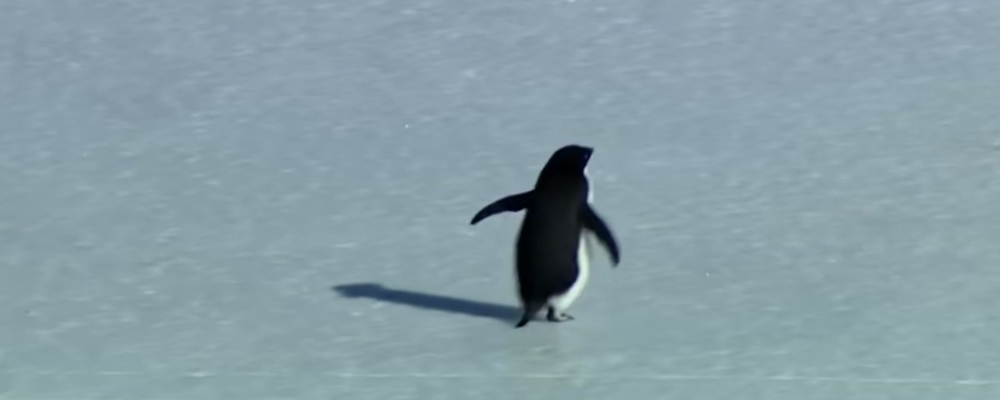

# 🚩 Poros Security Freepass 2026 🚩

## 📝 Task
1. Gunakan VPN UB jika mengakses beberapa challenge **web** dan **pwn** tanpa berhubung dengan WIFI-UBx, tata cara instalasi VPN UB sebagai [berikut](https://bits.ub.ac.id/katalog-layanan/layanan-komunikasi/vpn-ub/)
2. Masuk ke server **discord** POROS agar mendapatkan update terbaru tentang Freepass ini. [Masuk ke server Discord](https://discord.gg/PM4jDyfm).
3. Buatlah akun pada platform CTF [berikut](https://porosctf.com), gunakan email ub untuk mendaftar.
4. Kerjakan sebanyak mungkin challenge CTF yang diberikan.
5. Buatlah Writeup dengan ketentuan sebagai berikut:
	- Format `.pdf`
	- Nama berkas sebagai berikut: `Freepass POROS Security - Username CTF - Nama Lengkap.pdf`
	- Cantumkan nama lengkap, NIM, prodi, serta username CTF pada Writeup
	- Jelaskan secara jelas dan lengkap langkah-langkah dan script/program yang anda gunakan untuk menyelsesaikan challange-challenge yang diberikan.
	- Tidak diperbolehkan untuk hanya memberikan script. Peserta **tidak akan diwawancarai** apabila hanya memberikan script.
6. Adapun beberapa peraturan pengerjaan free pass:
    - Dilarang untuk melakukan Brute Force terhadap flag submission. 
    - Tidak boleh mengirim request terlalu banyak terhadap server atau melakukan eksploitasi pada platform CTF.
    - Penggunaan alat automasi seperti **John Hammond's Katana**, **Nmap**, **Metasploit**, **Sqlmap**, dan semacamnya tidak diperbolehkan.
Kegagalan untuk menuruti peraturan diatas akan ada konsekuensi.
7. Kumpulkan Writeup selambat lambatnya 18 Februari 2026 pukul 17:00 ke Google forms [berikut](https://clips.id/SubmissionFreepass2026).
8. Pilih waktu dan tanggal wawancara sesuai yang tersedia di google form.

## 📚 Reference
Biasakan diri dengan platform tersebut. Cari referensi mengenai istilah berikut,
- [PicoCTF](https://play.picoctf.org/)
- [Wargames](https://overthewire.org/wargames/)
- CTF in Cyber Security
- Jeopardy CTF
- CTF Documentation
- CTF Write-up ([contoh Write-Up](https://github.com/abiabdillahx/ctf-writeup/blob/main/Internal/COSMOS%20UB%202024/Write-Up%20COSMOS%202024%20-%20Imagine%20Losing.pdf))

Pelajari dasar-dasar dari materi di kategori berikut,
- Dasar Logika
- Digital Forensics
- Steganografi
- Kriptografi
- Reverse Engineering
- Web Exploitation
- Binary Exploitation

## 👏 Bonus Points
Dapatkan bonus poin dengan membuat write-up yang komprehensif, mudah dipahami, dan sesuai dengan challenge yang diselesaikan.

## ⚠️ Attention
> Pastikan mengerjakan soal dengan sungguh-sungguh, catat dokumentasi penyelesaian dalam satu dokumen untuk setiap soal yang berhasil maupun belum selesai dikerjakan.

> No Cheating, dilarang mengerjakan soal bersama dengan peserta lain. Soal dikerjakan sendiri-sendiri.

> Challengee diperbolehkan untuk mencari di internet untuk referensi solving

> Jadwal tepatnya wawancara akan diberitahukan setelah mengumpulkan Writeup dan memilih tanggal wawancara

## ⌛ Deadline
 - Start: 11 Februari 2026, 17:00
 - Scoreboard Freeze: 16 Februari 2026, 18:00
 - End: 17 Februari 2026, 18:00 
 - End of Writeup Submission: 18 Februari 2026, 17:00

## 🤙 Contact
Contact kami jika ada kendala.
| Nama  | Contact                             |
| ----- | ----------------------------------- |
| Abi   | [Whatsapp](https://wa.me/089618667937)    |
| Ari   | [Whatsapp](https://wa.me/081xxx)    |

